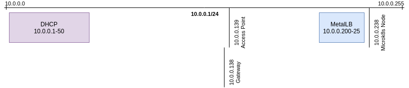

# k8s-gitops

Repo for my k8s home lab.

## Features

* Microk8s (Host Storage)
* Flux2
* MetalLB
* ExternalDNS (AWS/Route53)
* Transmission (NAT/UDP)
* MiniDLNA (UPnP/UDP)
* Monitoring (Helm/kube-prometheus-stack)
* Logging (Helm/loki-stack)

## Diagram




## Requirements

```
Ubuntu 20.04.1 LTS
```

## Setup

```
GITHUB_USERNAME= GITHUB_TOKEN= bin/bootstrap
```

## Notes

- http://transmission.home.jamesmoriarty.xyz
- http://alertmanager.home.jamesmoriarty.xyz:9093/
- http://grafana.home.jamesmoriarty.xyz/explore
- http://prometheus.home.jamesmoriarty.xyz:9090/